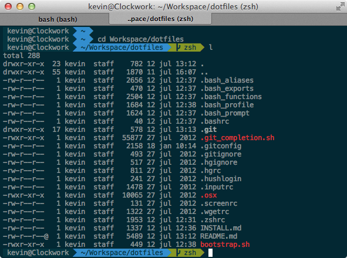

# Mac OS X setup

This is a list of reproducible steps to get a clean Mac up and running with nice dotfiles for Bash and ZSH, plus a whole bunch of development tools. Tested on OS X 10.8 (Mountain Lion) and 10.9-dp2 (Mavericks).

## Step 1: prepare Mac OS X

1. Install Xcode from the App Store
2. Open Xcode's preferences and install the command line tools package (this will also install Git)
3. Install http://coderwall.com/p/dlithw *(optional)*
4. Install http://www.starryhope.com/keyfixer/ *(optional)*

## Step 2: install Homebrew

    $ ruby -e "$(curl -fsSL https://raw.github.com/mxcl/homebrew/go)"

To update Homebrew itself:

    $ brew update

## Step 3a: install dotfiles dependencies

### For Bash

    $ brew install bash-completion

### For ZSH
I'm using oh-my-zsh with the agnostic theme.

    $ curl -L https://github.com/robbyrussell/oh-my-zsh/raw/master/tools/install.sh | sh

To get the [agnostic theme](https://github.com/robbyrussell/oh-my-zsh/wiki/Themes) to work:

1. install the powerline fonts from https://github.com/Lokaltog/powerline-fonts/tree/master/Menlo
2. install the Solarized Dark colorscheme in iTerm2 or OS X Terminal from http://ethanschoonover.com/solarized

## Step 3b: install the dotfiles

The dotfiles setup everything from your bash prompt and handy git aliases to new shortcut commands like `localip` and `rmds`.

    $ git clone https://github.com/kevinrenskers/dotfiles.git && cd dotfiles && ./bootstrap.sh

**Restart your shell after it's done.** Read the `INSTALL.md` file for more detailed instructions and tips.

On a fresh Mac you might want to run `$ . .osx` to setup some sensible defaults.

## Step 4: anything else you need

### Python

    $ brew install giflib jpeg
    $ sudo easy_install readline
    $ sudo easy_install pip
    $ sudo pip install virtualenv
    $ sudo pip install PIL
    
    
### Ruby, RVM (Ruby Version Manager) and RubyGems

    $ curl -L https://get.rvm.io | bash -s stable --ruby
    
Ignore the instructions to insert the rvm script into your bash profile - if you installed my dotfiles, that's already included.
    
**Restart your shell after it's done** and test with `ruby --version`, it should have installed version 2.x. If you want to stay on Ruby 1.9.3, run these commands after restarting your shell:

    $ rvm install 1.9.3
    $ rvm --default use 1.9.3

Once RVM is installed you can install your favorite packages:

    $ gem install cocoapods
    $ gem install rails

To update RVM itself:

    $ rvm get stable

To update RubyGems itself:

    $ gem update --system

### PostgreSQL

    $ brew install postgresql
    $ initdb /usr/local/var/postgres
    $ cp /usr/local/Cellar/postgresql/9.2.4/org.postgresql.postgres.plist ~/Library/LaunchAgents/
    $ launchctl load -w ~/Library/LaunchAgents/org.postgresql.postgres.plist

To use with Python:

    $ sudo pip install psycopg2

### MySQL

    $ brew install mysql
    $ unset TMPDIR
    $ mysql_install_db --verbose --user=`whoami` --basedir="$(brew --prefix mysql)" --datadir=/usr/local/var/mysql --tmpdir=/tmp
    $ ln -sfv /usr/local/opt/mysql/*.plist ~/Library/LaunchAgents
    $ launchctl load -w ~/Library/LaunchAgents/homebrew.mxcl.mysql.plist
    $ mysql_secure_installation
    $ sudo cp $(brew --prefix mysql)/support-files/my-default.cnf /etc/my.cnf
    
To use with Python:

    $ sudo pip install mysql-python
    
Config file:
    
    /usr/local/Cellar/mysql/5.6.12/my.cnf

Starting and stopping the server:

    $ launchctl load -w ~/Library/LaunchAgents/homebrew.mxcl.mysql.plist
    $ launchctl unload -w ~/Library/LaunchAgents/homebrew.mxcl.mysql.plist

### Node.js and NPM (Node Package Manager)

    $ brew install node
    $ curl https://npmjs.org/install.sh | sh

Once NPM is installed you can install your favorite packages:

    $ npm install -g coffee-script
    $ npm install -g less

To update NPM itself:

    $ npm install npm -g

### Nginx

    $ brew install nginx
    $ sudo ln -sfv /usr/local/opt/nginx/*.plist /Library/LaunchAgents
    $ sudo mkdir /var/log/nginx/

Edit `/usr/local/etc/nginx/nginx.conf`, change port to 80 and error_log to `/var/log/nginx/error.log`. Then start the server:

    $ sudo nginx

Config file:

    /usr/local/etc/nginx/nginx.conf

Other commands:

    $ sudo nginx -s stop
    $ sudo nginx -s reload

### PHP-FPM

    $ brew tap josegonzalez/homebrew-php
    $ brew tap homebrew/dupes
    $ brew install php55 --with-mysql --with-fpm
    $ ln -sfv /usr/local/opt/php55/*.plist ~/Library/LaunchAgents
    $ launchctl load -w ~/Library/LaunchAgents/homebrew-php.josegonzalez.php55.plist

Example Nginx config (place in `server` directive):

    location ~ \.php$ {
        fastcgi_pass   127.0.0.1:9000;
        fastcgi_index  index.php;
        include        fastcgi_params;
        fastcgi_param  SCRIPT_FILENAME $document_root$fastcgi_script_name;
    }

Config files:

    /usr/local/etc/php/5.5/php-fpm.conf
    /usr/local/etc/php/5.5/php.ini

Starting and stopping the server:

    $ launchctl load -w ~/Library/LaunchAgents/homebrew-php.josegonzalez.php55.plist
    $ launchctl unload -w ~/Library/LaunchAgents/homebrew-php.josegonzalez.php55.plist

## Thanks to...
* Mathias Bynens for sharing [his dotfiles](https://github.com/mathiasbynens/dotfiles), bootstrap script and installation instructions.
* Michael Moyle for his Nginx/PHP-FPM [installation instructions](http://michaelmoyle.blogspot.com/2013/01/install-php-with-nginx-and-php-fpm.html).
