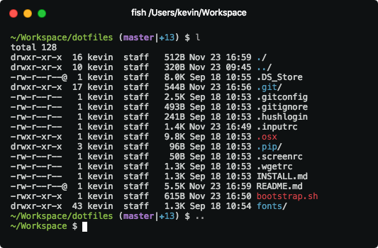

# Mac OS X setup

This is a list of reproducible steps to get a clean Mac (with Apple Silicon) up and running with nice dotfiles for Fish, plus a whole bunch of apps and development tools.



## Step 1: ssh keys

Restore your saved ssh keys or [create a new pair](https://help.github.com/articles/generating-a-new-ssh-key-and-adding-it-to-the-ssh-agent/).

Make sure they have the right permissions:

    $ chmod 600 ~/.ssh/* && chmod 700 ~/.ssh && chmod 644 ~/.ssh/*.pub

## Step 2: install Homebrew and git

    $ /bin/bash -c "$(curl -fsSL https://raw.githubusercontent.com/Homebrew/install/HEAD/install.sh)"
    $ (echo; echo 'eval "$(/opt/homebrew/bin/brew shellenv)"') >> /Users/kevin/.zprofile
    $ eval "$(/opt/homebrew/bin/brew shellenv)"
    $ brew analytics off

## Step 3: dotfiles

Clone this repository

    $ git clone git@github.com:kevinrenskers/dotfiles.git

And run the `bootstrap.sh` script. Alternatively, only run the `setup.sh` scripts in specific subfolders if you don't need everything.

**Restart your shell after it's done.**

You can now run `fish_config` to change the terminal colors, abbreviations, etc.

Don't forget to set your git credentials, or you'll be using my details which are in the dotfiles:

    $ git config --global user.name "Kevin Renskers"
    $ git config --global user.email "kevin@loopwerk.io"

## Step 4: anything else you need

### Python

I'm using [uv](https://docs.astral.sh/uv/) as the Python and package manager for Python projects. I do not use Homebrew to install Python, nor do I use the system version of Python.

While uv can install any Python version, these installs are not available globally (i.e. via the `python` command). You need to use `uv run` for one-off scripts or to start a shell (i.e. `uv run python`), or create virtual environments using `uv init`. See https://docs.astral.sh/uv/guides/scripts/#using-different-python-versions for more information.

### git up

I love [git up](https://github.com/msiemens/PyGitUp), which updates all local branches with remote changes, by rebasing rather than merging. You just run `git up` in your project and everything is up to date.

After installing pipx, you can simply install git up with one command:

    $ pipx install git-up

### Ruby

I'm using rbenv instead of the system Ruby, to prevent annoying permission problems. You should never have to use `sudo` to install gems!

```
brew install rbenv
rbenv init
```

Follow the printed instructions to set up rbenv shell integration. Close your terminal and open a new one so the changes take effect. Then verify that everything is okay:

```
curl -fsSL https://github.com/rbenv/rbenv-installer/raw/master/bin/rbenv-doctor | bash
```

Now you can install (and then use) a Ruby version, for example:

```
rbenv install 2.6.4
rbenv global 2.6.4
```

### PostgreSQL

Simply download Postgres.app from http://postgresapp.com. I love [Postico 2](https://eggerapps.at/postico2/) as my database client.

After installing Postgres.app, run the following command to get access to the command line tools:

    sudo mkdir -p /etc/paths.d && echo /Applications/Postgres.app/Contents/Versions/latest/bin | sudo tee /etc/paths.d/postgresapp

### Node.js and NPM (Node Package Manager)

I'm using [pnpm](https://pnpm.io) as my Node package manager, and to install specific Node versions.

    $ curl -fsSL https://get.pnpm.io/install.sh | sh -
    $ pnpm env use --global lts

Restart your shell and check if everything works: `node --version`.

To update pnpm itself:

    $ pnpm add -g pnpm

### Nginx

    $ brew install nginx
    $ sudo ln -sfv /usr/local/opt/nginx/*.plist /Library/LaunchAgents
    $ sudo mkdir /var/log/nginx/

Edit `/usr/local/etc/nginx/nginx.conf`, change `port` to `80` and `error_log` to `/var/log/nginx/error.log`. Then start the server:

    $ sudo nginx

Config file:

    /usr/local/etc/nginx/nginx.conf

Other commands:

    $ sudo nginx -s stop
    $ sudo nginx -s reload

## Thanks to...

- Mathias Bynens for sharing [his dotfiles](https://github.com/mathiasbynens/dotfiles), bootstrap script and installation instructions.
- Michael Moyle for his Nginx/PHP-FPM [installation instructions](http://michaelmoyle.blogspot.com/2013/01/install-php-with-nginx-and-php-fpm.html).
- Rosco Kalis for sharing [hit dotfiles](https://github.com/rkalis/dotfiles)
