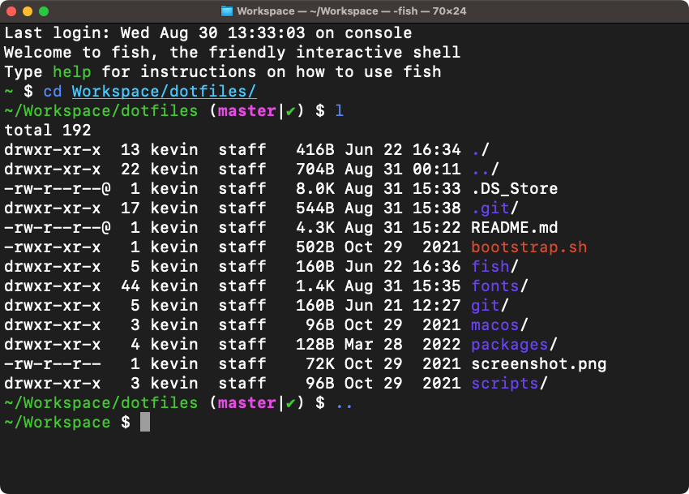

# Mac OS X setup

This is a list of reproducible steps to get a clean Mac up and running with nice dotfiles for Fish, plus a whole bunch of apps and development tools.

## Step 1: prepare Mac OS X

1. Install Xcode from the App Store, open it, let it install additional tools
2. Install the command line tools package with `xcode-select --install`
3. Install http://www.starryhope.com/keyfixer/ *(optional)*

Set your git credentials:

    $ git config --global user.name "Kevin Renskers"
    $ git config --global user.email "kevin@loopwerk.io"

## Step 2: install Homebrew and required packages

    $ ruby -e "$(curl -fsSL https://raw.githubusercontent.com/Homebrew/install/master/install)"
    $ brew analytics off
    $ brew install coreutils

## Step 3: dotfiles

Clone this repository

    $ git clone git@github.com:kevinrenskers/dotfiles.git

And run the `bootstrap.sh` script.

**Restart your shell after it's done.** 

You can now run `fish_config` to change the terminal colors, abbreviations, etc.

## Step 4: anything else you need

### Python
I'm using [Homebrew's Python](https://docs.brew.sh/Homebrew-and-Python.html).

    $ brew install python

A great package to install:

    $ pip install git-up

Upgrade pip or setuptools itself:

    $ pip install --upgrade pip
    $ pip install --upgrade setuptools

### PostgreSQL

    $ brew install postgresql
    $ initdb /usr/local/var/postgres
    $ cp /usr/local/Cellar/postgresql/9.2.4/org.postgresql.postgres.plist ~/Library/LaunchAgents/
    $ launchctl load -w ~/Library/LaunchAgents/org.postgresql.postgres.plist

To use with Python:

    $ export CFLAGS=-Qunused-arguments
    $ export CPPFLAGS=-Qunused-arguments
    $ sudo pip install psycopg2

Or simply download Postgress.app from http://postgresapp.com.

### MySQL

    $ brew install mysql
    $ brew services start mysql
    $ mysql_secure_installation

To use with Python:

    $ sudo pip install mysql-python

Manually Starting and stopping the server:

    $ mysql.server start
    $ mysql.server start

### Node.js and NPM (Node Package Manager)

    $ brew install node

Once this is installed you can install your favorite packages:

    $ npm install -g raml2html
    $ npm install less --save

To update NPM:

    $ npm install npm -g

### Nginx

    $ brew install nginx
    $ sudo ln -sfv /usr/local/opt/nginx/*.plist /Library/LaunchAgents
    $ sudo mkdir /var/log/nginx/

Edit `/usr/local/etc/nginx/nginx.conf`, change `port` to `80` and `error_log` to `/var/log/nginx/error.log`. Then start the server:

    $ sudo nginx

Config file:

    /usr/local/etc/nginx/nginx.conf

Other commands:

    $ sudo nginx -s stop
    $ sudo nginx -s reload

## Thanks to...
* Mathias Bynens for sharing [his dotfiles](https://github.com/mathiasbynens/dotfiles), bootstrap script and installation instructions.
* Michael Moyle for his Nginx/PHP-FPM [installation instructions](http://michaelmoyle.blogspot.com/2013/01/install-php-with-nginx-and-php-fpm.html).
* Rosco Kalis for sharing [hit dotfile](https://github.com/rkalis/dotfiles)
